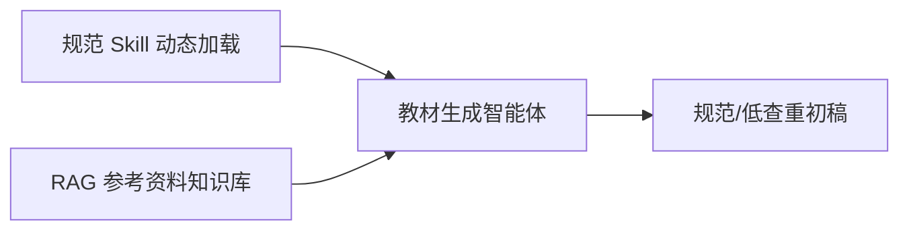
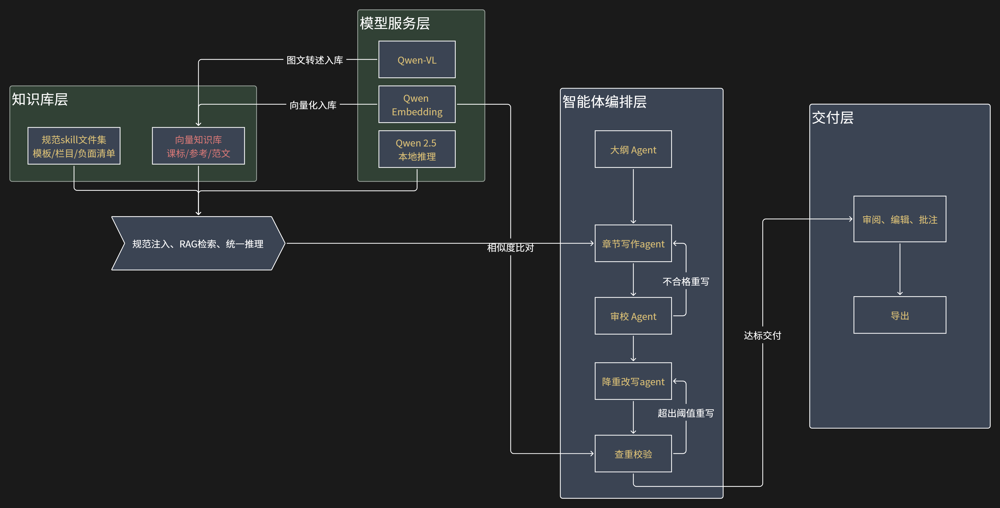
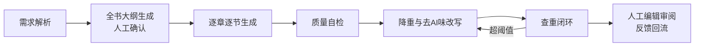
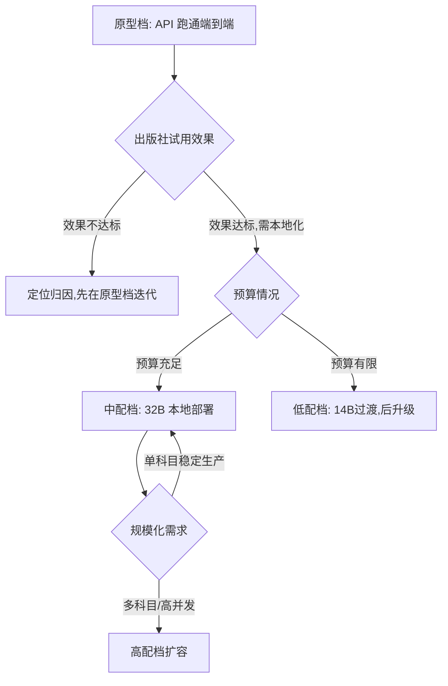

# 教材智能体方案设计

版本：V1.0（初稿）
定位：面向出版社汇报与内部技术评审的可行方案
说明：文中预算均为量级估算，落地前需按实际市场询价确认

---

## 1. 项目背景与目标

### 1.1 项目背景

出版社反馈，当前收到的教材初稿普遍存在三类问题：

| 问题 | 具体表现 |
| --- | --- |
| AI 味重 | 套话连篇、排比堆砌、语气千篇一律，一眼可辨为机器生成 |
| 质量不高 | 结构松散、知识点讲解深度不当、与课标/学段不匹配 |
| 查重率高 | 大量内容近似已有教材或网络资料，原创性不达标 |

### 1.2 项目目标

开发一个**垂直领域教材生成智能体**，产出满足以下要求的教材初稿：

1. **结构清晰**：章/节/目层级符合出版社体例，知识点编排符合课标与认知规律；
2. **风格规范**：语言风格贴近出版社编写规范与既有优秀教材，弱化 AI 生成痕迹；
3. **内容原创**：重复率控制在可接受阈值内，示例、习题、讲解表述均为原创化生成，可以稍微借鉴其他权威教材，但是不可完全照抄；
4. **数据安全**：模型与数据本地化部署，保障未出版教材稿件的知识产权与内容安全。

### 1.3 可量化的成功标准（建议值，可与出版社协商调整）

| 指标 | 目标值 | 检测方式 |
| --- | --- | --- |
| 全文查重率 | < 15%（单段落 < 20%） | 接入相似度检测工具 |
| AI 痕迹 | 编辑盲评中"明显 AI 味"占比 < 20% | 人工盲评 + AI 检测工具辅助 |
| 体例符合率 | 结构/栏目设置符合规范 ≥ 95% | 规则校验 + 编辑评审 |
| 编辑可用率 | 初稿经轻度修改即可进入编辑流程的比例 ≥ 60% | 出版社试用统计 |

### 1.4 实施原则

**先做原型，后看效果**：以最小成本快速跑通端到端流程，交付出版社试用收集反馈，再根据实际产出质量诊断问题、决定硬件投入与优化方向，避免一次性重投入。

---

## 2. 总体思路

会议已明确：**仅靠参考资料知识库不足以保证高质量输出**。本方案采用「双轮」路线：

1. **规范 Skill 动态加载（管"形"）**：将出版社体例规范、栏目模板、行文要求整理为结构化 Skill 文件（一种可被智能体按需读取的规范说明书），生成不同章节时动态注入，保证格式与结构合规。成本低、可随时更新，无需重新训练模型。
2. **RAG 参考资料知识库（管"料"）**：将课标、教学大纲、参考书、优质范文切片入库（RAG，即检索增强生成——生成前先检索相关资料喂给模型），保证内容素材有据可依、知识点准确。

两者分工：Skill 保结构、RAG 保内容；风格去 AI 味靠负面清单 Prompt、范文 few-shot 与后处理改写保障（见 §7.1），编辑修改数据留档积累（见 §5.7），为后续风格优化预留空间。

---

## 3. 技术选型

### 3.1 基座模型：Qwen（千问）

全链路统一采用 Qwen 系列，覆盖"生成、嵌入、多模态"所有环节：

| 环节 | 选型 | 理由 |
| --- | --- | --- |
| 文本生成 | Qwen2.5 系列（7B～72B） | 规格梯度完整，适配第 6 节四档算力；中文教育语料表现好 |
| API 原型 | DashScope / 阿里云百炼（qwen-max / qwen-plus） | API 生态成熟，原型阶段零硬件投入，正式期平滑转本地 |
| 文本嵌入 | Qwen Embedding 系列 | 与基座同源生态，中文教材语料效果好 |
| 多模态 | Qwen-VL 系列 | 教材插图、表格、公式等图文素材的理解与入库 |

**为何不采用 DeepSeek**：并非因其"没有向量数据库"（向量库本就是用 Milvus 等独立开源组件自建，与模型厂商无关），而是三点实质短板：① 缺少官方嵌入模型，RAG 需借用第三方嵌入，生态不闭环；② 多模态配套薄弱，难以处理教材中的图表、公式、插图素材；③ 主力模型为超大 MoE 架构，缺乏适配中小算力（单卡 24G～40G）本地部署的稠密规格。故不纳入本方案选型。

### 3.2 模型服务层

- **本地推理**：采用 **vLLM**（高吞吐推理引擎），提供 OpenAI 兼容 API，上层应用无需感知模型切换；选择理由：吞吐与社区成熟度均为同类第一梯队。
- **原型阶段**：直接调用 DashScope API（qwen-max / qwen-plus），零硬件投入。

### 3.3 智能体框架

- 智能体框架采用 **Qwen-Agent**（阿里官方）：Qwen-Agent 与 Qwen/DashScope/函数调用的适配性最好。
- 采用多 Agent 分工：大纲 Agent、章节写作 Agent、审校 Agent、降重改写 Agent（详见第 4、5 节）。

### 3.4 知识库（向量数据库）

- **向量数据库**：采用 **Milvus**。原型阶段用 Milvus Lite（嵌入式模式，pip 安装即用、无需部署服务），投产后无缝扩展为分布式部署，全程无迁移成本；

不采用轻量候选（Chroma 等）起步的原因：本项目语料为上亿字、百万级切片，轻量库中途必然触及性能瓶颈，届时迁移的工程成本与风险高于起步即用 Milvus Lite。

- **嵌入模型**：Qwen Embedding 系列（与基座同生态）；
- **多模态**：教材插图、表格截图经多模态嵌入或"图文转述"预处理后入库。

---

## 4. 系统架构

架构说明：

- **知识库层**：两类资产并列——规范 skill 文件集（编写规范）、向量知识库（内容素材）；
- **模型服务层**：Qwen-VL、Qwen Embedding 与 Qwen2.5 本地推理；
- **汇聚节点「规范注入、RAG 检索、统一推理」**：向量知识库、规范 skill 文件集与 Qwen2.5 本地推理三者先汇入此节点，再统一供给章节写作 Agent——体现写作前"检索 + 注入 + 推理"三件事在同一个环节完成；
- **智能体编排层**：大纲 Agent → 章节写作 Agent → 审校 Agent → 降重改写 Agent → 查重校验五站流水线，审校不合格回写作、查重超阈值回降重两条虚线闭环；
- **交付层**：查重达标后稿件进入「审阅、编辑、批注」，编辑确认后「导出」；批注修改自动留档（见 5.7 节）。
- **底座支撑线**：Qwen Embedding → 向量知识库（向量化入库）、Qwen Embedding ⇢ 查重校验（相似度比对，虚线）、Qwen-VL → 向量知识库（图文转述入库）、Qwen2.5 本地推理 → 汇聚节点（统一推理）。

### 4.1 两类数据资产的存储方式

两类资产**只有向量知识库需要建库**，规范 Skill 文件集为文件化管理，原则是：只有需要"海量切片 + 相似度检索"的数据才值得引入数据库：

| 数据资产 | 规模量级 | 是否需要检索 | 存储方式 | 说明 |
| --- | --- | --- | --- | --- |
| 向量知识库 | 上亿字、百万级切片 | 需要按相似度检索片段 | 向量数据库（如 Milvus） | 唯一真正"建库"的资产 |
| 规范 Skill 文件集 | 几十份、每份几千字 | 不需要，按章节类型取整份 | 文件系统 + Git 版本管理 | 写作 Agent 按目录规则直接读取整份文件拼入 Prompt |

### 4.2 编辑修改数据的留档

编辑批注修改自动记录为"AI 原文 → 编辑定稿"对照数据留档（见 5.7 节），用于 Skill 持续修订与后续风格优化。

---

## 5. 核心生成流程

### 5.1 需求解析

输入科目、学段、册次、课时量、课标文件；系统解析出知识模块清单与编写约束（如"初中数学、每节 2 课时、含例题 3 道与习题 1 组"）。

### 5.2 全书大纲生成（人工确认节点）

大纲 Agent 基于课标与课内知识图谱生成"章—节—目"树形大纲，含每节教学目标、知识点列表、栏目设置（导入/正文/例题/小结/习题）。**大纲必须经编辑确认后才进入正文生成**——这是编排层流水线中间的人机协同检查点（审"骨架"，区别于交付层对成稿的审阅），也是控制返工成本的关键人工节点。编辑对大纲的调整会被同步记录（见 5.7 节反馈回流）。

### 5.3 逐章逐节生成

写作 Agent 按节生成，每次生成注入四类上下文：

1. 大纲中该节的知识点与教学目标；
2. RAG 检索命中的参考资料片段（课标原文、参考书对应内容）；
3. 该章节类型对应的**体例规范 Skill 文件**（栏目模板、字数要求、术语规范）；
4. 同类型**优秀范文 few-shot 示例**（1～2 段，学表达不抄内容）。

生成时施加原创化约束：示例与习题必须新编（换数值、换情境），讲解表述不得复述检索片段原文。

### 5.4 质量自检

- **规则校验**：标题层级、栏目完整性、字数区间、图表编号连续性；
- **LLM-as-Judge**（用模型当评审）：知识点准确性、学段适切性、前后文术语一致性、风格一致性打分；
- 不合格项自动生成修改意见回炉重写，最多迭代 N 次（建议 N=3）后转人工。

### 5.5 降重与去 AI 味改写

改写 Agent 对初稿执行：原创化重述（保留知识点、重组表述）、句式多样化（长短句交错、消除模板化过渡语）、替换通用例句为学科情境化示例、清理负面清单词汇（"总而言之""值得注意的是"等高频 AI 套话）。

### 5.6 查重闭环

- 原型阶段：接入第三方查重 API（知网/维普类）或用"生成文本 vs 知识库语料"的本地相似度比对；
- 超阈值段落自动定位并回炉改写，直至达标或转人工处理；
- 查重报告随稿件一并交付编辑。

### 5.7 人工编辑审阅与修改留档

编辑在批注界面上的每一处修改，系统自动记录为"AI 原文 → 编辑定稿"对照数据，分类分开存放：正文改写对（文本对，每章几十～上百条）、大纲修订记录（结构化章节树调整，每书仅 1 条）。留档数据支撑 Skill 持续修订（即时生效，见 §7.3），并为后续风格优化积累素材（见 §7.1）。

---

## 6. 分档算力方案

按算力与预算由低到高提供四档方案，覆盖"零硬件验证"到"规模化生产"：

| 档位   | 硬件配置 | 预算量级 | 主生成模型 | 能力范围 | 适用场景 |
| --- | --- | --- | --- | --- | --- |
| **原型档** | 无 GPU，调用 DashScope API | token 费用约数千元/年 | qwen-max / qwen-plus | 全流程验证、Skill+RAG 调优 | 立项后前 2～4 周快速验证 |
| **低配档** | 单卡 RTX 4090/3090（24GB），工作站整机 | 约 2～3 万 | Qwen2.5-14B（4bit/8bit 量化） | 本地推理 + RAG | 效果验证通过但预算有限的过渡期（预算到位后升级中配） |
| **中配档** | 单卡 A100-40G，或双 4090（48GB） | 约 8～15 万 | Qwen2.5-32B | 本地推理 + 并发供多人试用 | 正式投产主力档位 |
| **高配档** | 2～4 卡 A100-80G / H800 服务器 | 约 30～60 万 | Qwen2.5-72B | 全量 SFT、超长上下文、高并发、多科目并行生产 | 规模化、多出版社业务 |

 预算为设备量级估算，不含机房、网络、运维与软件人力，需按实际询价确认。

### 模型组合与显存分配

除上表主生成模型外，系统运行还需两个辅助模型：Qwen-VL（插图/表格转述）与 Qwen Embedding（向量化入库、查重比对），各档完整组合如下（均为 4bit 量化/常见显存量级）：

| 档位 | 模型组合（显存合计） | 部署方式 |
| ---  | --- | --- |
| 原型档 | 全部走 API（qwen-max / qwen-vl-max / text-embedding-v4） | 无显存问题 |
| 低配档（24G） | 14B 量化（≈10G）+ VL-3B（≈7G）+ Embedding-0.6B（≈1.5G）≈ 18G | 主模型常驻，VL/Embedding 离线错峰加载 |
| 中配档（40～48G） | 32B 量化（≈20G）+ VL-7B（≈16G）+ Embedding-4B（≈8G）≈ 44G | 双 4090 可同时常驻；40G 卡则辅助模型降为 3B/0.6B 规格 |
| 高配档（2～4×80G） | 72B 全精度需双卡并行，辅助模型可顶配 | 多卡分工：生成卡 + 入库/查重卡 |

两个关键事实支撑此分配：① 辅助模型是小头，满配合计仅约 24G，主模型才是显存大头；② 资料入库是离线批处理，不必与主模型同时在线——vLLM 支持模型动态加载卸载，低配档可"生成时段挂主模型、入库时段换 VL+Embedding"错峰共用一张卡，无需为辅助模型额外采购硬件。

### 决策路径建议

核心逻辑：**先在原型档把"效果问题"解决掉，再用硬件采购解决"安全与规模问题"**，避免在方案未验证前重资产投入。

---

## 7. 三大关键问题的专项策略

### 7.1 去 AI 味

| 手段 | 作用 | 阶段 |
| --- | --- | --- |
| 负面清单 Prompt | 明确禁止套话、排比堆砌、空洞总结 | 原型即有 |
| 范文 few-shot | 用真实教材语感引导表达 | 原型即有 |
| 编辑修改数据驱动 Skill 修订 | 持续对齐人工编辑口味 | 长期机制 |
| 去 AI 味后处理改写 | 交付前最后一道润色 | 原型即有 |

### 7.2 降重

1. **生成时约束**：原创化指令 + 禁止复述检索原文（检索资料只作事实依据）；
2. **生成后比对**：查重检测定位高相似段落；
3. **闭环改写**：超阈值段落定点重写，而非全文重生成，降低成本。

### 7.3 质量与规范

1. **体例模板强约束**：每类章节绑定规范 Skill 文件，结构化输出（JSON/模板槽位）保证栏目齐全；
2. **审校 Agent 双重校验**：规则校验兜底硬性规范，LLM-as-Judge 兜底软性质量；
3. **编辑反馈迭代**：出版社每轮试用意见转化为 Skill 修订或微调语料，规范文件支持热更新、无需重训模型。

---

## 8. 评估体系

| 评估维度 | 方法 | 频率 |
| --- | --- | --- |
| 结构/体例符合率 | 规则校验脚本自动统计 | 每次生成 |
| 重复率 | 查重工具（第三方 API 或本地比对） | 每次交付 |
| AI 味 | AI 检测工具辅助 + 编辑盲评（混排人工稿件对照） | 每轮迭代 |
| 内容准确性 | 学科编辑抽查 + 课标知识点对照 | 每轮迭代 |
| 系统效果对比 | A/B 实验：有无 RAG、不同规格模型 | 每个里程碑 |

每次向出版社交付均附**评估报告**，用数据说话，支撑后续投入决策。

---

## 9. 实施路线图（原型优先）

### 第 1 阶段：API 原型（约 2 周）

- 目标：端到端跑通"需求 → 大纲 → 章节生成 → 初稿导出"；
- 配置：DashScope API + Milvus Lite 向量库 + 首批体例 Skill 文件（人工整理 3～5 类章节模板）；
- 范围：选 1 个科目、1 个章节类型做完整样章；
- **资料策略（窄而全）**：无需全量语料，出版社先行交付"样章资料包"——该章对应课标部分 + 1～2 本参考书相关章节 + 2～3 篇范文 + 体例规范文档，即可支撑流程验证；同时出版社全量资料整理（授权确认、数字化、清洗打标）并行启动，为第 2 阶段全量入库积累；
- **验收标准**：产出样章交出版社，编辑给出结构化评审意见（重点看流程是否跑通、体例是否合规、方向是否有戏，不以全量资料效果要求）；
- 回退策略：效果不达标时按下述分层诊断法定位归因，不进入采购流程。

**效果问题分层诊断法**：流水线各环节中间产物（检索命中片段、最终 Prompt、生成结果）全程留痕；固定一套"诊断样章集"（固定题目、固定资料、固定评审标准），按控制变量逐层排查：

| 现象 | 诊断动作 | 归因 |
| --- | --- | --- |
| 检索命中片段人工核查即不相关/缺失 | 调整切块大小、检索数量、元数据过滤 | RAG 工程问题 |
| 检索准确但生成未用好资料 | 手工将正确资料直接粘贴进 Prompt 重跑对比 | Prompt/Skill 拼装层问题 |
| 手工喂资料效果仍空泛套话 | 补充针对性参考资料重跑（成本数元） | 资料不足 |
| 资料齐全、检索准确仍写得差 | 换更大 API 型号（qwen-plus→qwen-max）验证 | 模型能力上限 |

注意：API 的 qwen-max 强于本地可部署的 14B/32B，故本阶段效果是本地化后的**上限参照**；API 与本地的量化差距在第 2 阶段用同样章并行生成对比验证。

### 第 2 阶段：本地化 + RAG 完善（约 4～6 周）

- 目标：数据不出域的可用系统；
- 配置：按第 6 节决策路径采购对应档位硬件，vLLM 部署 Qwen2.5-14B/32B；
- 工作：参考资料全量入库、规范 Skill 库扩充、审校与降重 Agent 上线、查重闭环打通、Word 导出与批注界面；
- **验收标准**：出版社编辑完成不少于 3 章的试用，量化指标达到 1.3 节目标值；
- 回退策略：本地小模型若显著劣于 API，采用"本地小模型生成 + 关键润色环节调 API"的混合模式过渡。

### 第 3 阶段：规模化（按算力与业务进度，约 6～10 周）

- 目标：多科目覆盖、稳定投产；
- 工作：多科目 Skill 与知识库扩展；编辑器深度集成（批注界面、导出流程）；
- **验收标准**：新科目样章通过结构化评审；编辑可用率达标；
- 回退策略：资料到位慢于预期时，先稳定单科目生产，扩展延后。

---

## 10. 风险与应对

| 风险 | 影响 | 应对措施 |
| --- | --- | --- |
| 模型幻觉、知识点错误 | 教材出现事实性错误，影响出版质量 | 知识点以 RAG 检索的课标/权威资料为依据并标注来源；审校 Agent + 学科编辑人工终审兜底（AI 产初稿、人工把终审） |
| 查重接口成本 | 全量查重费用高 | 先本地比对粗筛、达标临界段再调第三方精查；按章节增量查重 |
| 算力采购周期长 | 阻塞本地化进度 | 原型档用 API 先行，采购与开发并行推进 |
| 出版社规范模糊/变动 | Skill 频繁返工 | 第一阶段即与编辑共建规范清单，Skill 文件版本化管理、热更新 |
| 版权合规 | 参考资料入库引发版权争议 | 仅使用出版社授权素材；生成内容做原创化约束与查重 |

