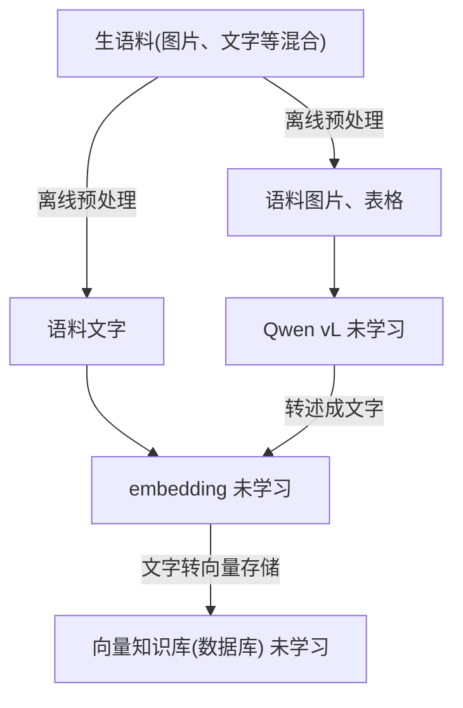
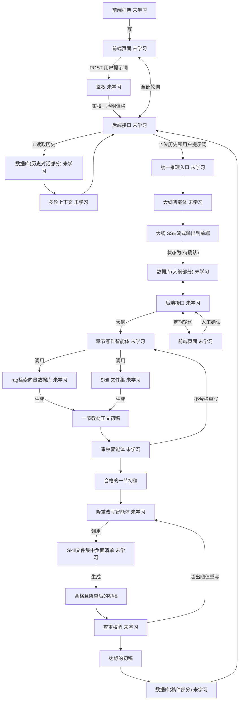

**知识库准备**

**系统运行**
>P = 统一推理入口：大纲、写作、审校、降重所有需要生成文本的环节都通过它调用模型，背后是同一个 Qwen 主生成模型（72B）；智能体之间传稿件不走 P，走编排层内部交接。

>U = Skill 文件集中的负面清单资产：被拼进 降重改写智能体 的 Prompt 作为清理依据；稿件本身不穿过 U，降重改写智能体 拿到 U 的内容后直接产出 合格且降重后的初稿。

>C / Y / Z 是同一个 MySQL 数据库里的三类表（历史对话、稿件、大纲），拆开画只为排版。

